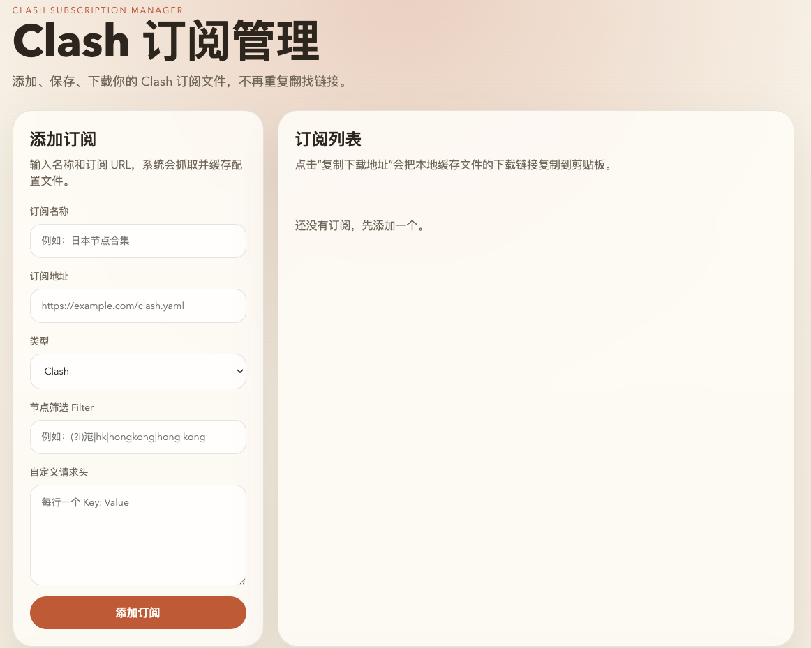
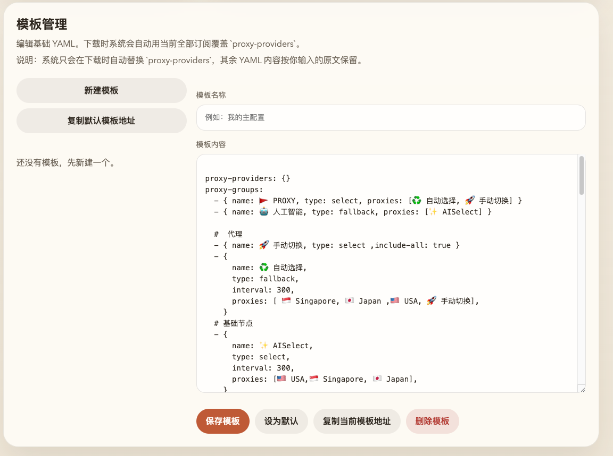

# Clash Subscription Manager

A small web app for managing Clash subscription links and cached config files.

**[简体中文版 README](README.zh-CN.md)** | English

## Screenshots





## Features

- Add Clash subscriptions from a URL
- Save downloaded configs locally
- Update subscription URL, provider filter, headers, and cached file
- Copy local download URLs from the web UI
- Manage multiple Clash templates and set one as default
- Edit template YAML directly in the web UI
- Download rendered templates with `proxy-providers` generated from all current subscriptions
- Set an optional per-subscription `filter` value that is injected into rendered `proxy-providers`
- Delete subscriptions and cached files together

## Run locally

```bash
go run .
```

The app reads configuration from `config.yaml` and listens on port `8080` by default.
On startup it logs the current version, for example:

```text
starting clash-subscription-manager v1.0.2 on port 8080
```

## Templates

- Create, edit, delete, and switch between multiple templates in the web UI.
- The saved YAML is the base config. When you download a template, the server replaces `proxy-providers` with entries generated from all current subscriptions.
- If a subscription has a `filter` value, the renderer writes it into that provider entry. Empty `filter` values are omitted.
- Render URL for a specific template: `/api/templates/{id}/render`
- Render URL for the default template: `/api/templates/default/render`

## Docker

Build:

```bash
docker build -t zhf883680/clash-subscription-manager:latest .
```

Run:

```bash
docker run --rm -p 8080:8080 \
  -v $(pwd)/data:/app/data \
  zhf883680/clash-subscription-manager:latest
```

## Project Links

- **GitHub Repository**: https://github.com/zhf883680/clash-subscription-manager
- **Docker Hub Image**: https://hub.docker.com/r/zhf883680/clash-subscription-manager
